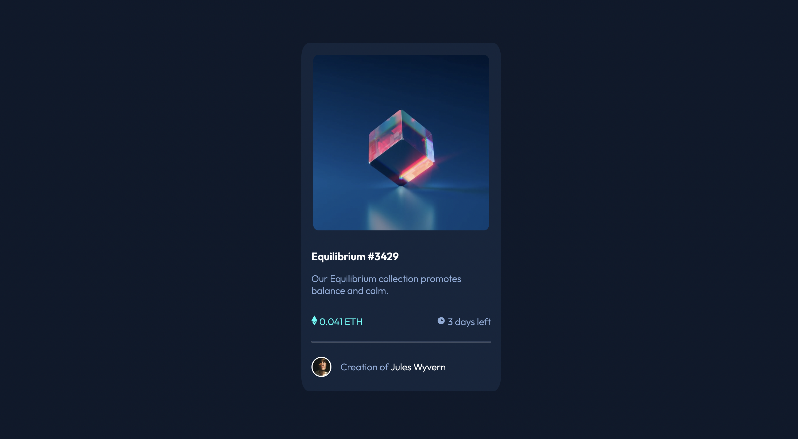

# Frontend Mentor - NFT preview card component solution

This is a solution to the [NFT preview card component challenge on Frontend Mentor](https://www.frontendmentor.io/challenges/nft-preview-card-component-SbdUL_w0U). Frontend Mentor challenges help you improve your coding skills by building realistic projects.

## Table of contents

- [Overview](#overview)
  - [The challenge](#the-challenge)
  - [Screenshot](#screenshot)
  - [Links](#links)
- [My process](#my-process)
  - [Built with](#built-with)
  - [What I learned](#what-i-learned)
  - [Useful resources](#useful-resources)
- [Author](#author)
- [Acknowledgments](#acknowledgments)

## Overview
challenge is to build out this preview card component and get it looking as close to the design as possible.

Can use any tools.

### The challenge

Users should be able to:

- View the optimal layout depending on their device's screen size
- See hover states for interactive elements

### Screenshot

### Links

- Solution URL: [Add solution URL here](https://your-solution-url.com)
- Live Site URL: [Add live site URL here](https://your-live-site-url.com)

## My process

### Built with

- HTML5
- CSS
- Flexbox

### What I learned

From this project I learned how to overlap background images and practiced the hover property.

### Useful resources

- [Example resource 1](https://developer.mozilla.org/en-US/docs/Web/) - This helped me with background/hover properties

## Author

- Website - [Ashley Rivas](https://rivasash1.github.io/ashsite/)
- Frontend Mentor - [@rivasash1](https://www.frontendmentor.io/profile/rivasash1)
- linkedin - [Ashley Rivas](https://www.linkedin.com/in/ashley-r-707ba0165/)
